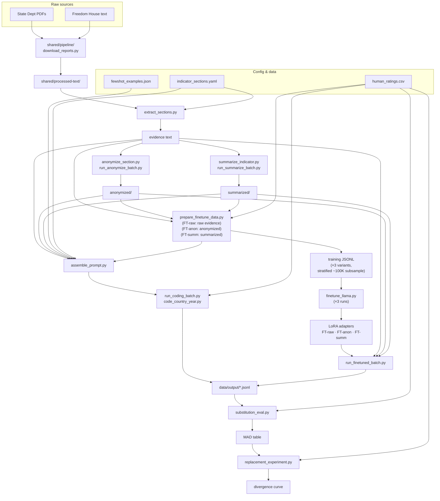

# Panel Member: Pipeline Architecture

## Pipeline overview



---

## File reference

### Setup (one-time runs)

| Script | What it does |
|---|---|
| `populate_section_mappings.py` | Reads indicator-to-section mapping notes; writes `state-dept` and `freedom-house` fields into `indicator_sections.yaml` |
| `populate_fewshot_examples.py` | Computes panel means from `human_ratings.csv` (2016–2018); selects one globally distributed example per ordinal level per indicator; writes `fewshot_examples.json` and `fewshot_example_pool.json` |
| `populate_fewshot_anonymized.py` | Compiles anonymized text for the few-shot example pool into `fewshot_examples_anonymized.json`, run after `run_anonymize_batch.py` completes for the example countries |
| `populate_fewshot_summarized.py` | Compiles summarized text for the few-shot example pool into `fewshot_examples_summarized.json`, run after `run_summarize_batch.py` completes for the example countries |

### Ingestion & country resolution

| Script | What it does |
|---|---|
| `shared/pipeline/download_reports.py` | Downloads State Dept HTML, Freedom House HTML, and IRFR executive summaries; writes to `shared/processed-text/` |
| `shared/pipeline/check_section_coverage.py` | Audits which YAML section keys appear or are absent in parsed documents for a given year; flags non-country filenames to add to `SLUG_OVERRIDES` |
| `country_map.py` | Builds `{iso: (slug, name)}` from State Dept filenames using pycountry fuzzy match; `SLUG_OVERRIDES` handles multi-year naming variants and non-country artifacts |

### Extraction, anonymization & summarization

| Script | What it does |
|---|---|
| `extract_sections.py` | Regex section extraction driven by `indicator_sections.yaml`; handles IRFR redirect (section 2c) and Section 6 population-specific sub-parsing |
| `anonymize_section.py` | LLM call (Llama 70B) that strips country identity from extracted text; caches to `anonymized/{year}/{iso}/{indicator}.txt`; idempotent |
| `run_anonymize_batch.py` | Batch driver for `anonymize_section.py`; skips cached files; safe to interrupt and resume |
| `summarize_indicator.py` | LLM call (Llama 70B) that rewrites the assembled, indicator-targeted evidence as a generic ~300–400 word description of political conditions — discarding named entities and the content fingerprints that survive named-entity anonymization; caches to `summarized/{year}/{iso}/{indicator}.txt`; idempotent |
| `run_summarize_batch.py` | Batch driver for `summarize_indicator.py`; skips cached files; safe to interrupt and resume |

### Prompt assembly & inference

| Script | What it does |
|---|---|
| `assemble_prompt.py` | Builds `(system, user)` prompt pair for any of the ten condition strings (four primary conditions, their zero-shot ablations, and the three finetuning-data-assembly shorthands); loads the matching few-shot block (`fewshot_examples.json` / `_anonymized.json` / `_summarized.json`) with focal-country exclusion |
| `code_country_year.py` | Single LLM call; returns rating + justification + token counts + raw response; writes one JSONL row |
| `run_coding_batch.py` | Batch driver for codebook, evidence, anonymized, summarized, and zeroshot conditions across countries × years × indicators |

### Fine-tuning

| Script | What it does |
|---|---|
| `prepare_finetune_data.py` | Pairs section text (raw for FT-raw; anonymized for FT-anon; summarized for FT-summ) with individual coder ratings from `human_ratings.csv` (2016–2018); writes training JSONL — run once per variant via `--variant {raw,anon,summ}` |
| `subsample_finetune_data.py` | Draws the shared, indicator-stratified ~100K-case training subsample for each variant from the full ~898K-row pool (see `notes/finetuning-epochs.md`) |
| `finetune_llama.py` | QLoRA fine-tuning of Llama-3.3-70B-Instruct on Pegasus GH200/A100 80GB with early stopping on held-out validation loss; run three times to produce FT-raw, FT-anon, and FT-summ adapters |
| `run_finetuned_batch.py` | Inference with a loaded LoRA adapter; no few-shot block; run with raw, anonymized, or summarized evidence text depending on the adapter |

### Evaluation

| Script | What it does |
|---|---|
| `substitution_eval.py` | MAD from raw panel mean by condition × model × indicator; signed-deviation table by democracy quintile as compression diagnostic |
| `replacement_experiment.py` | Simulates replacing k human coders with AI; reports divergence from full-panel mean by k |
| `run_reid_no_exec.py` | Pilot re-identification script (exec-summary-included vs. excluded) used to validate the exec-summary-fallback-only policy and motivate the summarized condition; ran on a 98-CYI pilot sample, not part of the confirmatory analysis pipeline |

### Shared

| Script | What it does |
|---|---|
| `vdem_config.py` | Model identifiers, API base URLs, output path conventions, shared constants |

---

## Stage 1: Ingestion

`shared/pipeline/download_reports.py`. Scrapes State Dept HTML reports, Freedom House HTML, and IRFR executive summaries; writes plain text to `shared/processed-text/`. Run from the `shared/` directory.

```
shared/processed-text/
  state-dept/{year}/{slug}.txt
  freedom-house/{year}/{slug}.txt
  irfr/{year}/{slug}.txt
```

Panel-member accesses these files via symlinks under `data/processed-text/`.

---

## Stage 2a: Section Extraction

`pipeline/extract_sections.py` + `config/indicator_sections.yaml`.

Regex parsing pulls indicator-relevant sections from processed text. The YAML covers all 206 retained Type C indicators with `state-dept` and `freedom-house` section keys.

Two sections receive special handling:

- **Section 2c** redirects to the IRFR (International Religious Freedom Report); the executive summary is loaded from `processed-text/irfr/{year}/{slug}.txt` instead of the main State Dept file.

- **Section 6** (Discrimination, Societal Abuses, and Trafficking in Persons) is sub-parsed for indicators that target a specific population. The optional `sec6_subsections` field in the YAML selects the relevant sub-section (`"women"`, `"minorities"`, `"trafficking"`, `"other_societal"`). The minorities header is year-aware (changed in 2020 and again in 2021). Indicators without a `sec6_subsections` field receive the full Section 6 block.

```yaml
v2clacjstw:   # Access to justice for women
  state-dept: ["1d", "1e", "6"]
  freedom-house: ["F"]
  sec6_subsections: "women"

v2clgeocl:    # Urban-rural equality in civil liberties (cross-cutting)
  state-dept: ["6"]
  freedom-house: ["D", "G"]
```

---

## Stage 2b: Anonymization

`pipeline/anonymize_section.py` + `pipeline/run_anonymize_batch.py`.

Used for the `anonymized` and `finetuned-anon` conditions. One LLM call rewrites extracted text to replace the country name with `[COUNTRY]`, replace named parties and officials with generic descriptions ("the ruling party", "senior officials"), and paraphrase datable events that would identify the country-year.

Output is cached at `data/processed-text/anonymized/{year}/{iso}/{indicator}.txt`. The batch runner skips cached files, so runs are safe to interrupt and resume.

Motivation: preliminary results suggest models use country identity as a regime-type anchor rather than reasoning from described conditions. The `evidence` vs. `anonymized` comparison tests this directly on the same extracted text.

---

## Stage 2c: Summarization

`pipeline/summarize_indicator.py` + `pipeline/run_summarize_batch.py`.

Used for the `summarized` and `finetuned-summ` conditions. Unlike anonymization, which is a section-level, named-entity-replacement pass, summarization operates at the **indicator level**: the summarizer sees the full assembled evidence for a country-year-indicator (all relevant sections from both sources) and rewrites it as a single ~300–400 word, indicator-targeted, generic description of political conditions — discarding proper names, structural specifics with no evaluative signal, and datable events, while preserving quantitative and frequency information.

Output is cached at `data/processed-text/summarized/{year}/{iso}/{indicator}.txt` (one file per country-year-indicator, not per section). The batch runner skips cached files, so runs are safe to interrupt and resume.

Motivation: a pilot re-identification experiment (98 CYIs) found that named-entity anonymization plateaus around 51–61% top-1 re-identification because content fingerprints — distinctive constitutional arrangements, treaty relationships, electoral structures — survive name replacement. Summarization addresses this by discarding those fingerprints along with the names, at the cost of some evaluative specificity. See `notes/summarization-strategy.md` and `notes/exec-summary-policy-and-summarization-condition.md`.

---

## Stage 3: Coding

### Prompt conditions

| Condition | Evidence text | Few-shot block | Models |
|---|---|---|---|
| `codebook` | none | none | All 4 |
| `evidence` | raw section text | yes | 70B base only |
| `anonymized` | anonymized text | yes (anonymized) | 70B base only |
| `summarized` | summarized text | yes (summarized) | 70B base only |
| `evidence-zeroshot` | raw section text | none | FT-raw; also 2019 few-shot ablation (70B base) |
| `anonymized-zeroshot` | anonymized text | none | FT-anon; also 2019 few-shot ablation (70B base) |
| `summarized-zeroshot` | summarized text | none | FT-summ; also 2019 few-shot ablation (70B base) |
| `finetuned-raw` | raw section text | none | Training-data-assembly shorthand; maps to `evidence-zeroshot` at inference |
| `finetuned-anon` | anonymized text | none | Training-data-assembly shorthand; maps to `anonymized-zeroshot` at inference |
| `finetuned-summ` | summarized text | none | Training-data-assembly shorthand; maps to `summarized-zeroshot` at inference |

The three fine-tuned variants (FT-raw, FT-anon, FT-summ) participate in all four primary conditions — codebook, evidence, anonymized, summarized — but without a calibration block. At inference they use `codebook`, `evidence-zeroshot`, `anonymized-zeroshot`, and `summarized-zeroshot` respectively. The `finetuned-raw` / `finetuned-anon` / `finetuned-summ` condition strings in `assemble_prompt.py` are used only by `prepare_finetune_data.py` to build training records.

Llama 405B and 8B are not run: 405B does not fit GW Pegasus's available allocation (2 eight-A100 nodes cluster-wide), and 8B was dropped to keep the design focused on information-source effects rather than an underpowered scale comparison. An early two-condition (codebook, evidence) smoke test on Llama 8B validated pipeline mechanics only; its output was never analyzed and is not part of the confirmatory results.

The few-shot block contains one calibration example per ordinal level (up to five), drawn from the 2016–2018 training window and globally distributed across seven regions. At inference time, any example whose ISO code matches the focal country is removed; affected country-indicator combinations receive four examples instead of five. See `notes/fewshot-example-design.md`.

### Output schema

```json
{
  "country":        "HTI",
  "year":           2019,
  "indicator":      "v2csreprss",
  "model":          "llama-3.3-70b-instruct",
  "model_key":      "llama-70b",
  "condition":      "evidence",
  "prompt_variant": "panel-member-v1",
  "rating":         1,
  "raw_mean":       1.3571,
  "signed_dev":     -0.3571,
  "abs_dev":        0.3571,
  "justification":  "...",
  "sources":        ["state-dept", "freedom-house"],
  "section_keys":   {"state-dept": ["2b", "5"], "freedom-house": ["E"]},
  "tokens":         {"input": 1240, "output": 48},
  "raw_response":   "..."
}
```

`raw_mean` is the panel mean from `panel_means.csv` for this country-year-indicator; `signed_dev = rating − raw_mean`; `abs_dev = |rating − raw_mean|`. All three fields are `null` for the `codebook` condition (no panel mean available without evidence text).

Output path: `data/output/{model_key}_{condition}_{indicator}_{year}.jsonl`

### Fine-tuning (FT-raw, FT-anon, FT-summ)

Three fine-tuned Llama-3.3-70B adapters are trained in parallel — on raw evidence text (FT-raw), anonymized evidence text (FT-anon), and summarized evidence text (FT-summ). All three use the same coder-level ratings as targets; the only difference is the input text. The source pool is ~898K coder-CYI rows across all 206 indicators, 2016–2018; each variant trains on a shared, indicator-stratified ~100K-case subsample of that pool (`subsample_finetune_data.py`; see `notes/finetuning-epochs.md`) rather than the full pool, given measured single-node throughput.

**Training data** (`prepare_finetune_data.py --variant {raw,anon,summ}`): run once per variant. One row per coder per country-year-indicator.

```json
{
  "messages": [
    {"role": "system",    "content": "<global framing>"},
    {"role": "user",      "content": "<raw, anonymized, or summarized section text>"},
    {"role": "assistant", "content": "{\"rating\": 2}"}
  ]
}
```

**Fine-tuning** (`finetune_llama.py`): QLoRA (4-bit, rank 16, alpha 32) on `meta-llama/Llama-3.3-70B-Instruct`. Run three times on GW Pegasus GH200/A100 80GB — one job per adapter — with early stopping on held-out validation loss and epoch extension over the shared subsample rather than a fixed epoch count. At inference, no few-shot block; each adapter runs under `codebook`, `evidence-zeroshot`, `anonymized-zeroshot`, and `summarized-zeroshot`.

**Key comparisons**: FT-anon vs. base 70B (anonymized) and FT-summ vs. base 70B (summarized) isolate what embedding calibration in weights adds over in-context few-shot examples for each de-identification strategy. FT-anon vs. FT-raw and FT-summ vs. FT-raw show whether anonymizing or summarizing the training data changes calibration independently of the corresponding manipulation at inference.

As of pre-registration, all three fine-tuning tracks are in the pipeline-testing stage (smoke tests to validate the training loop) — no adapter has completed training and no inference has been run on any fine-tuned model.


---

## Stage 4: Calibration Check

`pipeline/substitution_eval.py`

MAD from raw panel mean per condition × model × indicator. A signed-deviation table by democracy quintile serves as the compression diagnostic. Identifies the best-performing combination to carry forward to Stage 5.

---

## Stage 5: Replacement Experiment

`pipeline/replacement_experiment.py`

```python
for cy in eval_pool:
    for b in range(B):
        removed = sample(human_coders[cy], 1)
        human_subset = [r for r in human_ratings[cy] if r.coder_id not in removed]
        aug_mean = mean(human_subset + [ai_rating])   # single AI rating, best-calibrated model
        divergences.append(abs(aug_mean - full_panel_mean(cy)))
```

`k=1` only — with a single base model (70B) and no distinct-scale peers, there is no principled way to source k≥2 genuinely independent AI coders, so the k=2/k=3 arms from the original design are dropped. Output: divergence with 95% CI, stratified by democracy quintile.

---

## Data directory

```
panel-member/
  config/
    indicator_sections.yaml             # section mappings for all 206 Type C indicators
  data/
    human_ratings.csv                   # individual coder ratings (v15 coder-level dataset)
    fewshot_examples.json               # calibration examples (one per level per indicator)
    fewshot_examples_anonymized.json    # anonymized calibration examples
    fewshot_examples_summarized.json    # summarized calibration examples
    fewshot_example_pool.json           # (country, year) index of few-shot pairs
    processed-text/
      state-dept/{year}/{slug}.txt
      freedom-house/{year}/{slug}.txt
      irfr/{year}/{slug}.txt
      anonymized/{year}/{iso}/{indicator}.txt
      summarized/{year}/{iso}/{indicator}.txt
    processed/
      cy_pool.csv                       # locked replacement experiment pool
      training_set_{raw,anon,summ}.csv  # fine-tuning country-year-indicator list, per variant
    output/                             # coded JSONL files (gitignored)
  notes/
    fewshot-example-design.md           # training-window restriction and focal-country exclusion
    summarization-strategy.md           # summarization design and Benoit et al. comparison
    exec-summary-policy-and-summarization-condition.md  # exec-summary fallback policy; summarized condition rationale
    finetuning-epochs.md                # stratified subsample + early-stopping protocol
    mechanism-test-design.md            # unified re-id / name-swap / info-shift design; 2024 holdout
    hpc-sequencing-strategy.md          # Pegasus/Raptor setup and TRES resource requests
```
