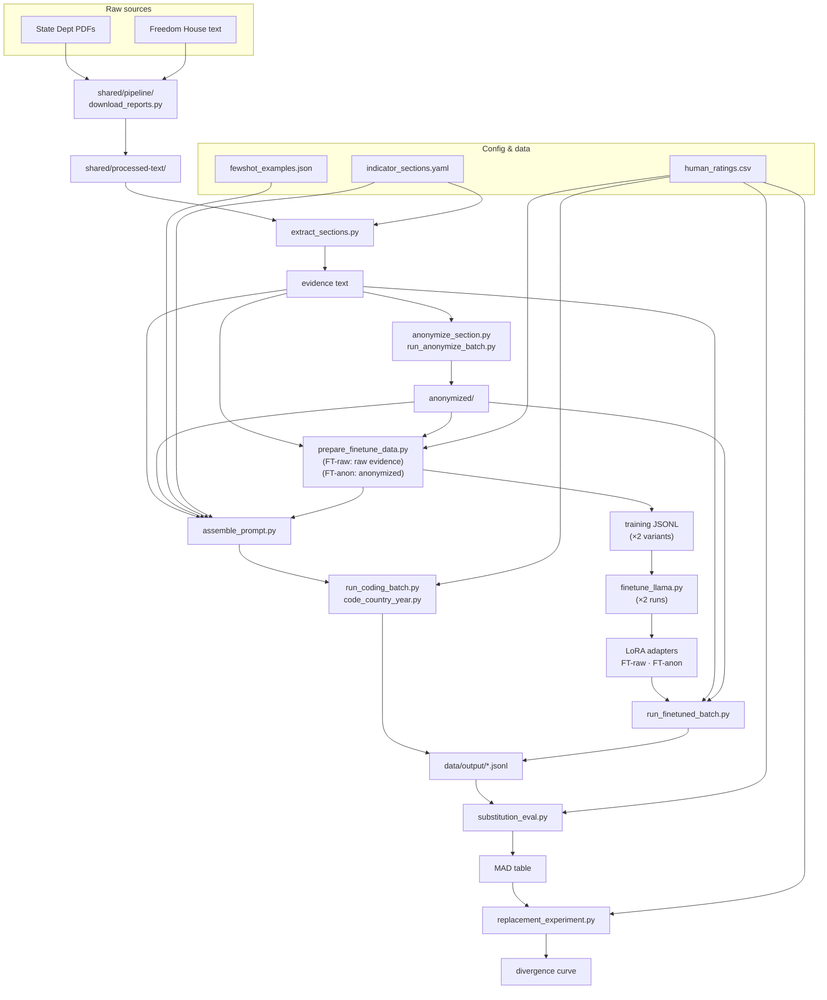

# Panel Member: Pipeline Architecture

## Pipeline overview



---

## File reference

### Setup (one-time runs)

| Script | What it does |
|---|---|
| `populate_section_mappings.py` | Reads indicator-to-section mapping notes; writes `state-dept` and `freedom-house` fields into `indicator_sections.yaml` |
| `populate_fewshot_examples.py` | Computes panel means from `human_ratings.csv` (2016–2018); selects one globally distributed example per ordinal level per indicator; writes `fewshot_examples.json` and `fewshot_example_pool.json` |

### Ingestion & country resolution

| Script | What it does |
|---|---|
| `shared/pipeline/download_reports.py` | Downloads State Dept HTML, Freedom House HTML, and IRFR executive summaries; writes to `shared/processed-text/` |
| `shared/pipeline/check_section_coverage.py` | Audits which YAML section keys appear or are absent in parsed documents for a given year; flags non-country filenames to add to `SLUG_OVERRIDES` |
| `country_map.py` | Builds `{iso: (slug, name)}` from State Dept filenames using pycountry fuzzy match; `SLUG_OVERRIDES` handles multi-year naming variants and non-country artifacts |

### Extraction & anonymization

| Script | What it does |
|---|---|
| `extract_sections.py` | Regex section extraction driven by `indicator_sections.yaml`; handles IRFR redirect (section 2c) and Section 6 population-specific sub-parsing |
| `anonymize_section.py` | LLM call (Llama 70B) that strips country identity from extracted text; caches to `anonymized/{year}/{iso}/{indicator}.txt`; idempotent |
| `run_anonymize_batch.py` | Batch driver for `anonymize_section.py`; skips cached files; safe to interrupt and resume |

### Prompt assembly & inference

| Script | What it does |
|---|---|
| `assemble_prompt.py` | Builds `(system, user)` prompt pair for any of the six conditions; loads few-shot block from `fewshot_examples.json` with focal-country exclusion |
| `code_country_year.py` | Single LLM call; returns rating + justification + token counts + raw response; writes one JSONL row |
| `run_coding_batch.py` | Batch driver for codebook, evidence, anonymized, and zeroshot conditions across countries × years × indicators |

### Fine-tuning

| Script | What it does |
|---|---|
| `prepare_finetune_data.py` | Pairs section text (raw for FT-raw; anonymized for FT-anon) with individual coder ratings from `human_ratings.csv` (2016–2018); writes training JSONL — run twice, once per variant |
| `finetune_llama.py` | QLoRA fine-tuning of Llama-3.3-70B-Instruct on Pegasus A100; run twice to produce FT-raw and FT-anon adapters |
| `run_finetuned_batch.py` | Inference with a loaded LoRA adapter; no few-shot block; run with raw or anonymized evidence text depending on the adapter |

### Evaluation

| Script | What it does |
|---|---|
| `substitution_eval.py` | MAD from raw panel mean by condition × model × indicator; signed-deviation table by democracy quintile as compression diagnostic |
| `replacement_experiment.py` | Simulates replacing k human coders with AI; reports divergence from full-panel mean by k |

### Shared

| Script | What it does |
|---|---|
| `vdem_config.py` | Model identifiers, API base URLs, output path conventions, shared constants |

---

## Stage 1: Ingestion

`shared/pipeline/download_reports.py`. Scrapes State Dept HTML reports, Freedom House HTML, and IRFR executive summaries; writes plain text to `shared/processed-text/`. Run from the `shared/` directory.

```
shared/processed-text/
  state-dept/{year}/{slug}.txt
  freedom-house/{year}/{slug}.txt
  irfr/{year}/{slug}.txt
```

Panel-member accesses these files via symlinks under `data/processed-text/`.

---

## Stage 2a: Section Extraction

`pipeline/extract_sections.py` + `config/indicator_sections.yaml`.

Regex parsing pulls indicator-relevant sections from processed text. The YAML covers all 206 retained Type C indicators with `state-dept` and `freedom-house` section keys.

Two sections receive special handling:

- **Section 2c** redirects to the IRFR (International Religious Freedom Report); the executive summary is loaded from `processed-text/irfr/{year}/{slug}.txt` instead of the main State Dept file.

- **Section 6** (Discrimination, Societal Abuses, and Trafficking in Persons) is sub-parsed for indicators that target a specific population. The optional `sec6_subsections` field in the YAML selects the relevant sub-section (`"women"`, `"minorities"`, `"trafficking"`, `"other_societal"`). The minorities header is year-aware (changed in 2020 and again in 2021). Indicators without a `sec6_subsections` field receive the full Section 6 block.

```yaml
v2clacjstw:   # Access to justice for women
  state-dept: ["1d", "1e", "6"]
  freedom-house: ["F"]
  sec6_subsections: "women"

v2clgeocl:    # Urban-rural equality in civil liberties (cross-cutting)
  state-dept: ["6"]
  freedom-house: ["D", "G"]
```

---

## Stage 2b: Anonymization

`pipeline/anonymize_section.py` + `pipeline/run_anonymize_batch.py`.

Used for the `anonymized` and `finetuned-anon` conditions. One LLM call rewrites extracted text to replace the country name with `[COUNTRY]`, replace named parties and officials with generic descriptions ("the ruling party", "senior officials"), and paraphrase datable events that would identify the country-year.

Output is cached at `data/processed-text/anonymized/{year}/{iso}/{indicator}.txt`. The batch runner skips cached files, so runs are safe to interrupt and resume.

Motivation: preliminary results suggest models use country identity as a regime-type anchor rather than reasoning from described conditions. The `evidence` vs. `anonymized` comparison tests this directly on the same extracted text.

---

## Stage 3: Coding

### Prompt conditions

| Condition | Evidence text | Few-shot block | Models |
|---|---|---|---|
| `codebook` | none | none | All 5 |
| `evidence` | raw section text | yes | Base models only (405B, 70B, 9B) |
| `anonymized` | anonymized text | yes (anonymized) | Base models only |
| `evidence-zeroshot` | raw section text | none | FT-raw + FT-anon; also 2023 ablation (best base model) |
| `anonymized-zeroshot` | anonymized text | none | FT-raw + FT-anon; also 2023 ablation (best base model) |
| `finetuned-anon` | anonymized text | none | Training-data-assembly shorthand; maps to `anonymized-zeroshot` at inference |

The two fine-tuned variants (FT-raw, FT-anon) participate in all three primary conditions — codebook, evidence, anonymized — but without a calibration block. At inference they use `codebook`, `evidence-zeroshot`, and `anonymized-zeroshot` respectively. The `finetuned-anon` condition string in `assemble_prompt.py` is used only by `prepare_finetune_data.py` to build training records.

The few-shot block contains one calibration example per ordinal level (up to five), drawn from the 2016–2018 training window and globally distributed across seven regions. At inference time, any example whose ISO code matches the focal country is removed; affected country-indicator combinations receive four examples instead of five. See `notes/fewshot-example-design.md`.

### Output schema

```json
{
  "country":        "HTI",
  "year":           2019,
  "indicator":      "v2csreprss",
  "model":          "llama-3.3-70b-instruct",
  "model_key":      "llama-70b",
  "condition":      "evidence",
  "prompt_variant": "panel-member-v1",
  "rating":         1,
  "raw_mean":       1.3571,
  "signed_dev":     -0.3571,
  "abs_dev":        0.3571,
  "justification":  "...",
  "sources":        ["state-dept", "freedom-house"],
  "section_keys":   {"state-dept": ["2b", "5"], "freedom-house": ["E"]},
  "tokens":         {"input": 1240, "output": 48},
  "raw_response":   "..."
}
```

`raw_mean` is the panel mean from `panel_means.csv` for this country-year-indicator; `signed_dev = rating − raw_mean`; `abs_dev = |rating − raw_mean|`. All three fields are `null` for the `codebook` condition (no panel mean available without evidence text).

Output path: `data/output/{model_key}_{condition}_{indicator}_{year}.jsonl`

### Fine-tuning (FT-raw and FT-anon)

Two fine-tuned Llama-3.3-70B adapters are trained in parallel — one on raw evidence text (FT-raw) and one on anonymized evidence text (FT-anon). Both use the same coder-level ratings as targets; the only difference is the input text. ~898K coder-CYI training examples each, across all 206 indicators, 2016–2018.

**Training data** (`prepare_finetune_data.py`): run twice — once with raw section text (FT-raw) and once with anonymized text (FT-anon). One row per coder per country-year-indicator.

```json
{
  "messages": [
    {"role": "system",    "content": "<global framing>"},
    {"role": "user",      "content": "<raw or anonymized section text>"},
    {"role": "assistant", "content": "{\"rating\": 2}"}
  ]
}
```

**Fine-tuning** (`finetune_llama.py`): QLoRA (4-bit, rank 16, alpha 32) on `meta-llama/Llama-3.3-70B-Instruct`. Run twice on GW Pegasus A100 80GB — one job per adapter. At inference, no few-shot block; both adapters run under `codebook`, `evidence-zeroshot`, and `anonymized-zeroshot`.

**Key comparison**: FT-anon vs. base 70B (anonymized) isolates what embedding calibration in weights adds over in-context few-shot examples. FT-anon vs. FT-raw shows whether anonymizing the training data changes calibration independently of the anonymization manipulation at inference.


---

## Stage 4: Calibration Check

`pipeline/substitution_eval.py`

MAD from raw panel mean per condition × model × indicator. A signed-deviation table by democracy quintile serves as the compression diagnostic. Identifies the best-performing combination to carry forward to Stage 5.

---

## Stage 5: Replacement Experiment

`pipeline/replacement_experiment.py`

```python
for cy in eval_pool:
    for k in [1, 2, 3]:
        for b in range(B):
            removed = sample(human_coders[cy], k)
            human_subset = [r for r in human_ratings[cy] if r.coder_id not in removed]
            ai_subset = ai_ratings[:k]   # k distinct models
            aug_mean = mean(human_subset + ai_subset)
            divergences.append(abs(aug_mean - full_panel_mean(cy)))
```

For k > 1, AI ratings come from k distinct models (k=2: Llama 405B + Llama 70B; k=3: adds Llama 9B). Assignment rule is pre-registered. Output: divergence curve by k (mean ± 95% CI), stratified by democracy quintile.

---

## Data directory

```
panel-member/
  config/
    indicator_sections.yaml             # section mappings for all 206 Type C indicators
  data/
    human_ratings.csv                   # individual coder ratings (v15 coder-level dataset)
    fewshot_examples.json               # calibration examples (one per level per indicator)
    fewshot_example_pool.json           # (country, year) index of few-shot pairs
    processed-text/
      state-dept/{year}/{slug}.txt
      freedom-house/{year}/{slug}.txt
      irfr/{year}/{slug}.txt
      anonymized/{year}/{iso}/{indicator}.txt
    processed/
      cy_pool.csv                       # locked replacement experiment pool
      training_set.csv                  # fine-tuning country-year-indicator list
    output/                             # coded JSONL files (gitignored)
  notes/
    fewshot-example-design.md           # training-window restriction and focal-country exclusion
    hpc-sequencing-strategy.md          # Pegasus/Raptor setup and TRES resource requests
```
